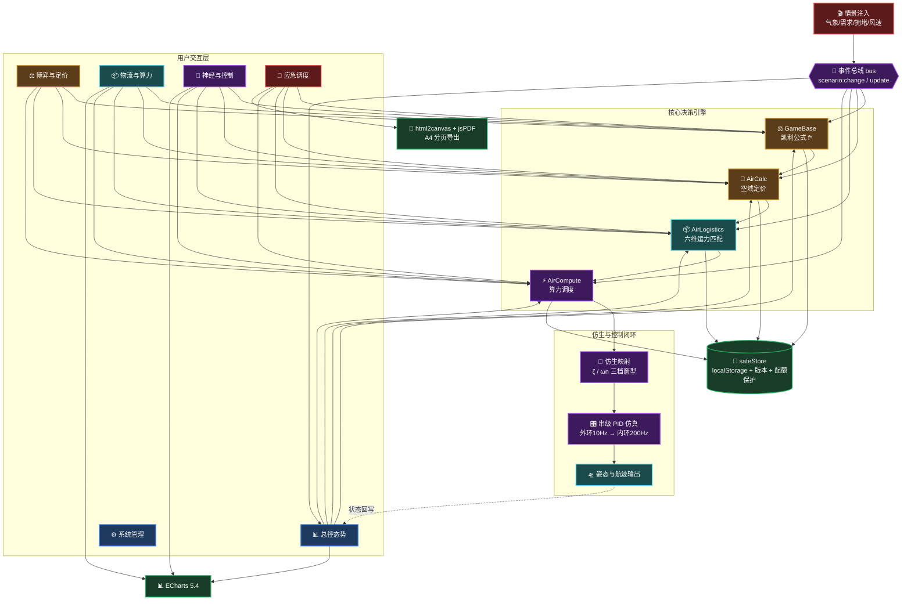

# 🧠 Y.Mine · AirMind V2.1
### 低空全域人机神经协同调度引擎 · Game-OS

<!-- ========== 🎨 彩色徽章带 ========== -->


> **在线体验**：https://hellomind-star.github.io/airmind-os/
> 打开即用，无需注册、无需后端、数据不出浏览器。

---

## 😫 传统低空调度之痛

| 痛点 | 传统方式 | AirMind 的解法 |
| :--- | :--- | :--- |
| **空域定价** | 靠拍脑袋或固定费率，旺季亏钱、淡季闲置 | 凯利公式动态博弈，自动计算最优出价比例 |
| **飞行控制** | 突遇侧风时飞控响应生硬，乘客像坐过山车 | 仿生映射将人体平衡机制迁移至无人机，稳如磐石 |
| **应急响应** | 翻 Excel 查机型匹配，黄金 10 分钟白白浪费 | 输入灾情参数，策略引擎毫秒级输出救援方案 |
| **数据安全** | 敏感运营数据上传云端，存在泄露和合规风险 | 纯本地存储，零上传，数据主权完全归用户 |

---

## 🚀 AirMind 的解法

**把"空域"变成可量化、可交易的数字资产——纯本地、零上传、秒级响应。**

AirMind 是一套**会博弈、懂仿生、能应急**的低空经济决策操作系统。它融合了凯利公式的博弈均衡、人体前庭平衡的仿生控制、以及串级 PID 的工业级闭环，让城市物流、应急救援和载人交通（UAM）的调度像呼吸一样自然。

> **一句话卖点**：让每一寸空域都产生价值，让每一次飞行都安全可控。

### ⚡ 六面板不是六张皮，是一条数据链

这是本版本最重要的架构变化。早期版本里 6 个 Tab 各自硬编码数字，互不相干；V2.1 把它们接到同一个 `store` + 事件总线上：

```
🎬 情景注入（气象 / 需求 / 拥堵 / 风速）
        │
        ├─→ ⚖️ 凯利公式重算 f* ──→ 气象溢价 / 时段 / 综合系数
        │                              │
        ├─→ 📊 总控态势：均衡度色带、任务量、延迟、雷达五维
        │
        └─→ 📦 运力匹配：抗风门槛 / 报价 / ETA 全部随之改变
```

点一次「🌧️ 暴雨突至」，四个面板同时重算——不是动画，是真算。

---

## 🧠 关于 AirMind

> **我们相信**：低空经济调度不该是僵硬的代码堆砌，而应兼具**生物的适应直觉**与**博弈论的决策理性**。

### 📦 核心能力矩阵

| 🎯 博弈决策<br><sub>让每一笔交易都盈利</sub> | 🧬 仿生控制<br><sub>让每一次飞行都平稳</sub> | 🔒 数据主权<br><sub>让每一条数据都安全</sub> |
| :---: | :---: | :---: |
| **凯利公式驱动**<br>`f* = (b·p − q)/b`，实时推导最优投入比例 | **人体前庭映射**<br>三种"窗型"对应不同阻尼比，风压→前庭→视觉 SLAM | **纯本地运算**<br>数据永不离开浏览器，满足企业数据合规要求 |
| **空域动态定价**<br>气象 × 时段 × 拥堵三重叠加，随行就市 | **串级双环 PID 仿真**<br>外环 10Hz 航线锁定 + 内环 200Hz 姿态抑制 | **零信任架构**<br>无埋点、无追踪、一键导出 JSON 冷备份 |

---

## 🎬 30 秒看懂：暴雨突至时发生了什么

在 **Tab 1** 顶部点「🌧️ 暴雨突至」，一次点击触发全链路（数据为实测输出）：

| 环节 | 常态 | 暴雨突至 | 说明 |
| :--- | :--- | :--- | :--- |
| 稳态均衡度 | 0.41 🟢 安全 | 0.63 🟡 预警 | 色带由绿转黄，熔断预警自动亮起 |
| 凯利 f* | 0.382 | **−0.062** | 由"建议投入 38% 仓位"翻转为"预期亏损，建议收缩" |
| 人机配比 | 25% | 37% | 自动化让位，人工接管权重上升 |
| 气象溢价 | 晴 +2% | 雷暴 **+34%** | 定价随行就市 |
| 活跃任务 | 1,284 | 1,886 | 需求倍率 1.55 驱动 |
| 抗风筛选 | 6 机型可用 | 固定翼被淘汰 | 侧风 15m/s 超其 12m/s 上限 |
| 侧风抗扰 | — | 切「多点锁平开窗」 | ζ=0.72，米级偏移 4s 内收敛 |

这就是 README 里那场"暴雨调度"，现在它是**可复现的按钮**，不是一段文字。

---

## 🧩 六个面板

| Tab | 名称 | 这次到底改了什么 |
| :---: | :--- | :--- |
| 1 | 📊 总控态势 | 新增**情景注入**；所有 KPI 由情景目标值收敛生成，不再是纯随机游走 |
| 2 | ⚖️ 博弈与定价 | 凯利结果回写全局，驱动其余面板；新增**多期蒙特卡洛风险推演**（破产概率 / 分位区间 / 几何增长） |
| 3 | 📦 物流与算力 | **真算法**：六维加权打分 + **匈牙利全局最优指派**，与贪心同屏对比并一键采用；工单可增删并持久化 |
| 4 | 🧬 神经与控制 | 新增**串级 PID 数值仿真**：t=1.5s 注入侧风阶跃，实时算出峰值偏移、调节时间、稳态误差并评级 |
| 5 | 🚨 应急调度 | 存储迁入统一封装，配额满了会提示而不是静默崩溃 |
| 6 | ⚙️ 系统管理 | 空域网格 / 白名单 / 策略规则 / 定价参数 / 电池台账 |

### Tab 3 匹配算法

```
硬门槛（任一不满足即淘汰，并给出原因）
  载重 ≥ 货重  ·  有效航程 = 标称航程 × (0.55 + 0.45×SOH/100)
  SOH ≥ 60%    ·  当前风速 ≤ 机型抗风上限  ·  ETA ≤ 时限

评分（0–100，仅对通过门槛的机型）
  载重 25% · 时效 22% · 电池 20% · 航程 18% · 成本 10% · 抗风 5%
```

> SOH 会直接吃掉可用航程——一块 65% 健康的电池，标称 25km 的多旋翼只剩约 21km 有效航程。这比"匹配度 96%"这种写死的数字诚实得多。

### Tab 3 全局最优指派：贪心为什么会输

逐单贪心有个隐蔽缺陷：**高分工单会抢走稀缺运力，把后面的订单活活饿死**。

以随机压测中增益最大的一例来说——7 个工单争抢 2 个槽位：

```
贪心：#1 先占走 41.3 分的槽位 → 后面两个 97.8 分的工单无槽可用 → 总分 78.5
全局：把该槽位让给更需要的工单            → 总分 195.6（+149%）
```

300 轮随机压测（工单与槽位各 2–9）的结果：

| 指标 | 结果 |
| :--- | :--- |
| 全局严格优于贪心 | **187 / 300 轮（62%）** |
| 两者持平 | 112 轮（无冲突时贪心本就是最优） |
| 全局劣于贪心 | **0 轮** |
| 平均增益 / 最大增益 | **+17.3% / +149.2%** |

实现上是把机型库存展开为槽位（固定翼 ×4 → `FG-07#01..#04`），构造分数矩阵后用匈牙利算法（Kuhn–Munkres，O(n³)）求最大权匹配。低于 35 分的指派宁可放弃——**不派比乱派好**。

正确性由 40 轮**暴力穷举对拍**保证：小规模下匈牙利解必须等于穷举最优。这条测试真的抓到过 bug——早期版本把"不分配"的代价设成 `maxV − minScore`，等于给每个未派工单白送 35 分，算法于是宁可少派，给出的解比贪心还差。

### Tab 3 风控 Agent + Guardrail：两道防线

Agent 负责**判断**，Guardrail 负责**复算**。两者独立——这是能不能真拦住错误的关键。

```
         ┌──────── Orchestrator（唯一落地入口）────────┐
         │                                             │
   全局指派 ──→ 风控 Agent ──→ Guardrail ──→ 落地       │
   assignFleet   evaluateRisk   guardrail     safePlan  │
                      │             │                  │
                 判断策略风险    复算物理约束            │
                 BLOCK → 整个方案不落地                 │
                              违规项 → 降级为"不派"     │
         └─────────────────┬───────────────────────────┘
                           ↓
                    决策轨迹 Trace（可回放 / 可追责）
```

**11 条规则，两级严重度：**

| 级别 | 规则 | 处理 |
| :--- | :--- | :--- |
| 🚫 **BLOCK** | 电池 SOH < 60%、侧风超抗风上限、超载、ETA 超时限、**负期望重仓**、破产概率 > 30%、系统熔断（均衡度 ≥ 0.80） | **整个方案不落地** |
| ⚠️ **WARN** | 破产概率 5–30%、低分派遣（< 50 分）、机型集中度 > 60%、运力缺口 | 可执行，但留痕提示 |

**为什么 Guardrail 不读 Agent 的结论？** 单测里有一条专门验证这件事：把规则库清空模拟 Agent 失效，Agent 返回"全绿放行"，而 Guardrail 依然拦下了侧风违规项。如果 Guardrail 只是复述 Agent 的判断，那它就不叫防线，只是回声。

**一道容易误读的现象**：切到「🌧️ 暴雨突至」时，风控 Agent 报 🚫 阻断，但 Guardrail 显示 ✅ 通过。这不是矛盾，恰恰是分工正确——指派引擎在打分阶段就把不抗风的机型判为 `null` 剔除掉了，Guardrail 复算时已无违规可查；而"负期望还在重仓"是策略层判断，只有 Agent 管得了。**物理约束归 Guardrail，策略风险归 Agent，两者不越权也不互相兜底。**

**决策轨迹**顺带解决了原路线图里的 V2.4 历史回放：每次编排记录时间、情景、指派数、风控级别、Guardrail 剔除数、最终裁决，持久化并可导出 JSON。最多保留 50 条。

### Tab 3 数据层：先有负载，才谈优化

此前 UI 里只有 **4 条写死的工单、6 个机型**，全局最优相对贪心的增益常年是 **0%**——不是算法不行，是根本没有运力竞争可优化。所以先把数据层补上，全部是带种子的纯函数（同种子逐位可复现）：

| 生成器 | 产出 | 设计要点 |
| :--- | :--- | :--- |
| `generateOrders(n)` | 订单流 | 距离偏短途带长尾、货重多数轻量、时限 = 最短耗时 × 松弛系数（1.15–3.5）。**刻意保证 >80% 工单理论可行**，否则生成的全是废单，测不出调度能力 |
| `generateFleet(n)` | 机队台账 | 按目标槽位数均分到 6 个机型原型，SOH 在 62–98 随机分布 |
| `generateWeatherSeries(n)` | 气象时序 | OU 均值回归 + 偶发雷暴骤增，替代原来"风速是个滑块常量"的做法 |

### Tab 3 分层求解：让千级工单真能在浏览器里跑完

纯匈牙利是 O(n²m)：1000 单 × 1000 槽 ≈ 10⁹ 次运算，浏览器直接卡死。分三步压复杂度：

```
1. 分窗    按时限升序切窗口（默认 60 单/窗），急单优先挑运力
2. 限量    每窗只保留 top-K 候选槽位，矩阵从 n×m 缩到 W×K
3. 局部交换 跨窗邻域 2-opt，把分窗损失的收益捞回来
```

**它是近似解，不是精确全局最优**——这点必须说清楚。但 `autoAssign` 有一条硬承诺：**绝不劣于贪心**。因为运力宽松时贪心本就接近最优，分层的近似损失可能反超收益，所以实现上会同时算贪心基线，**取两者较优**。

**实测（紧张度 = 槽位数 / 工单数）**：

| 规模 | 紧张度 | 求解耗时 | vs 贪心 |
| :--- | :--- | :--- | :--- |
| 500 单 | 0.5（紧张） | 194 ms | **+12.4%** |
| 1000 单 | 0.5 | 454 ms | **+12.8%** |
| 2000 单 | 0.3（极紧） | 728 ms | **+15.2%** |
| 3000 单 | 0.5 | 1.66 s | +8.3% |
| 10000 单 | 0.5 | **8.2 s** | +6.2% |

**一个反直觉但重要的发现**——调度优化的价值只在运力紧张时才体现：

| 紧张度 | 0.3 | 0.5 | 0.7 | 0.9 | 1.2 |
| :--- | :--- | :--- | :--- | :--- | :--- |
| 增益 | **+16.4%** | **+12.2%** | −1.4% | −1.6% | −2.3% |

资源过剩时贪心几乎就是最优解（每单都能挑到最想要的机型），此时任何"全局优化"都只能靠近似损失倒扣。这解释了为什么早期压测总显示 0%——默认参数恰好落在宽松区间。**加"取两者较优"的保底，就是为了让这个结论不会翻车成"用了优化反而更差"。**

> **关于"万级工单"**：10000 单能跑通（8.2s，增益 +6.2%），但这个耗时**必须放进 Web Worker**，否则主线程会卡死 8 秒。当前 UI 的规模选项上限是 2000 单——这是能保持交互流畅的真实边界。

### Tab 1 数字孪生空域：为什么不用真实瓦片地图

第一反应是接 MapLibre / Leaflet，但权衡后选了 **Canvas 自绘**：

| 方案 | 问题 |
| :--- | :--- |
| MapLibre + OSM 瓦片 | 引入 ~800KB 依赖；国内网络瓦片服务不稳定，**面试现场可能直接白屏**；破坏"双击就能跑"与秒开 |
| Canvas 自绘 | 需要自己写投影与渲染，但零依赖、离线可用、与暗色主题天然一致 |

更关键的是：**低空态势真正需要的是"空域网格 + 禁飞区 + 航线"，不是街道地图。** 真实底图在这里是干扰信息。

功能：

- **18 架航空器**沿 14 条航线循环执飞，机体朝向 = 实时航向（按 `bearingDeg` 计算）
- **4 个管制空域**（圆形进近管制区 / 多边形政务管制区 / 军事限高区），含高度上限语义
- 航迹拖尾、航线流动虚线、点击查看详情、悬停提示
- 播放 / 暂停 / 0.5–4× 变速 / 图层开关
- 实时统计：在空架数、空域违规、平均高度、渲染帧率

**空域违规检测不是装饰**。它和 Guardrail 同性质——是安全硬约束，所以地理计算放进 `algorithms.js` 而不是渲染层，可以被单元测试覆盖。含一条回归测试：

```js
// 起降点被判违规 → 净空区不应覆盖起降点本身
vertiports.forEach(v => {
  assert.equal(A.checkAirspace(v, zones).length, 0);
});
```

这条测试对应一个真实 bug：早期把禁飞区圆心直接压在机场上，导致 **39% 的飞机"一起飞就违规"**——那不是安全能力强，是规则建模错了。修正后违规率降到 **2/18**。

### 真实数据接入（带优雅降级）

`12-livefeed.js` 接 **OpenSky ADS-B**（真实航班）与 **Open-Meteo**（真实气象，无需 API Key）。

设计原则是**优雅降级**：网络不通、CORS 被拦、API 限流、返回空——任何一种情况都退回模拟推演，绝不留下白屏。界面徽章如实显示当前是「真实 ADS-B」还是「模拟推演」。

> ⚠️ **未能自测**：沙盒网络限制下 OpenSky / Open-Meteo 均返回 403，请求逻辑按「CORS + 超时（AbortController, 9s）+ 空结果」三层防御编写，**需在真实网络下验证**。这是本项目少数未经实测的部分。

*（注：OpenSky 免费账号有速率限制，频繁点击「接真实数据」可能触发 429，此时同样会降级。）*

### Tab 4 控制仿真

- 三种仿生"窗型"对应二阶系统参数：`无锁落地窗 ζ=0.18 / 推拉活动窗 ζ=0.45 / 多点锁平开窗 ζ=0.72`
- 外环 10Hz 解算航线偏差 → 输出期望姿态角；内环 200Hz 抑制姿态，抵抗风扰力矩
- 阻尼比越低越"飘"，需要越高的人工接管权重兜底（60% / 40% / 20%）
- 15 m/s 侧风实测：平开窗峰值偏移 0.077 m / 4.0 s 收敛 → 落地窗 0.242 m / 稳态 0.097 m

---

## ⚡️ 5 分钟快速上手（零安装）

```bash
git clone https://github.com/HelloMInd-star/airmind-os.git
cd airmind-os
# 双击 index.html 直接运行，或用 VS Code Live Server 打开
```

**5 步走完完整闭环：**

1. **注入情景**（Tab 1）→ 点「🌧️ 暴雨突至」，看四个面板同时翻脸。
2. **博弈竞价**（Tab 2）→ 拖动赔率 / 胜率滑条，凯利公式实时给出"投入 / 观望 / 收缩"三选一结论。
3. **制造运力竞争**（Tab 3）→ 连开几个高价值工单，看「全局最优指派」栏的增益从 0% 跳到两位数。
4. **看风控拦人**（Tab 3）→ 常态下点「编排执行」会落地；切到「🌧️ 暴雨突至」再点，会被 **负期望重仓 + 破产概率** 两项 BLOCK 拦住，**方案不落地**。
5. **试过度下注**（Tab 2）→ 点「对齐凯利 f*」看健康区间，再把仓位拉到 2 倍，破产概率会从 4.5% 飙到 97%，回到 Tab 3 编排即被风控阻断。
6. **姿态避险**（Tab 4）→ 拉到 15m/s 侧风，切换三种机型，看抗扰曲线和 A/B/C/D 评级变化。
7. **应急演练**（Tab 5）→ 填入"火势等级/被困人数"，策略引擎秒级亮出最优解并导出 PDF。

想验证算法本身：

```bash
npm test      # 40 项测试，含暴力对拍与随机化验证
```

> [!IMPORTANT]
> **首次使用必读**：所有数据仅保存在**当前浏览器**。清除站点数据会丢失配置，请定期在 Tab 5 或 Tab 6 导出 JSON 备份。

> [!TIP]
> 恢复出厂：控制台执行 `localStorage.clear()`。
> 深链分享：URL 加 `#tab4` 可直接跳转到神经与控制面板。

---

## 🔒 数据主权 · 绝对零信任

| 维度 | AirMind 承诺 |
| :--- | :--- |
| **数据流向** | 所有计算在浏览器内存与 localStorage 中完成，**永不跨过网线** |
| **第三方依赖** | 仅 CDN 加载 ECharts / html2canvas / jsPDF，无埋点、无追踪 |
| **企业合规** | 满足数据本地化存储要求，无需申报数据出境 |
| **备份策略** | 一键导出 JSON 冷备份，完全脱离厂商锁定 |
| **降级行为** | CDN 不可达时自动进入离线模式：图表停用，**计算与 JSON 导出仍可用** |

---

## 🏗️ 架构图（Mermaid）

> 颜色层级：🟠 博弈/价值 · 🔵 交互/UI · 🟣 算力/AI · 🟢 存储/基建 · 🔴 应急/告警



---

## 👥 谁在用？

| 角色 | 日常场景 |
| :--- | :--- |
| **调度指挥官** | 注入情景预演压力，调整空域定价，确保运力与需求实时平衡 |
| **应急响应员** | 快速录入突发事件，获取 AI 策略推荐，导出标准化处置报告 |
| **系统管理员** | 管理空域网格、企业白名单、机型库及电池健康台账 |
| **监管机构** | 查看空域资源利用率和定价透明度，辅助宏观决策 |

---

## 🧮 算法层与测试

V2.1 把所有纯计算抽到了 `assets/js/core/algorithms.js`——**无 DOM 依赖、UMD 包装**，浏览器里挂 `window.AirMind`，Node 里走 `module.exports`。于是同一份实现既驱动页面，又能被单元测试直接覆盖。

```bash
npm test        # 等价于 node --test tests/，零依赖，无需 npm install
```

**107 项测试，重点是不变量而非快照值**——把今天的输出钉死成断言，会让明天的重构寸步难行：

| 测试类型 | 覆盖内容 |
| :--- | :--- |
| **数学性质** | 数值扫描验证 `f*` 确实是增长率曲线峰值；过度下注必然劣于凯利仓位 |
| **单调性** | 阻尼比越高抗扰越强；侧风越大稳态误差单调上升；报价随溢价单调上升 |
| **硬门槛** | 五类不可行情形逐一验证，且必须给出可读的淘汰原因 |
| **暴力对拍** | 小规模下匈牙利解必须等于穷举最优（40 轮随机矩阵） |
| **随机化** | 60 轮随机矩阵下全局解不劣于贪心、无重复占用、无非法指派 |
| **★ Guardrail 独立性** | 清空规则库模拟 Agent 失效后，Guardrail 仍必须拦下违规项 |
| **★ 收敛性** | 对 Guardrail 净化后的方案二次校验必须全绿（50 轮随机） |
| **异常韧性** | 规则内部抛异常时升级为 BLOCK，绝不静默放行 |
| **可复现性** | 蒙特卡洛同种子必须逐位一致（mulberry32） |
| **性能** | 20 工单 × 28 槽位全局指派 < 200ms；1000 单分层求解 < 2s |
| **数据生成** | 订单流 >80% 理论可行；气象时序均值回归收敛；机队槽位编号唯一 |
| **空域地理** | 投影与反投影互逆；航点端点精确、中间无跳变；高度上限之上飞越合规 |
| **★ 回归** | 起降点不得被自身净空区误判（曾导致 39% 误报） |

> **为什么先做这步**：Agent 编排层的每个决策最终都落到这些函数上。地基不可信时，上层编排只会把局部最优放大成系统性错误。

### 测试真的抓到过 bug

| Bug | 怎么被抓到的 |
| :--- | :--- |
| 全局指派把"不分配"代价设成 `maxV − minScore` | 暴力对拍：算法给出 224，穷举最优 254.6。等于给每个未派工单白送 35 分，算法于是宁可少派，解比贪心还差 |
| Guardrail 早期版本直接复用 Agent 结论 | 独立性测试：清空规则库后 Guardrail 随之失效。改为独立复算物理约束后才真正成为第二道防线 |
| 蒙特卡洛期数文案写死 200 | 实际推演用 120 期，UI 却显示"200 期推演下…"，读数自相矛盾 |
| **分层求解在运力宽松时反比贪心差 2.6%** | 压测矩阵暴露的：近似损失超过了优化收益。修法是加"取两者较优"保底，把这变成一条可测试的硬承诺 |
| **禁飞区压在起降点上，39% 飞机"一起飞就违规"** | 手动核对违规率时发现的——规则建模错了，不是安全能力强。回归测试已固化 |
| **数据源徽章 id 不匹配**（HTML `airspaceSource` vs JS `airSource`） | 端到端测试显示徽章始终为空 |

## 🗺️ 路线图

| 版本 | 规划功能 | 状态 |
| :--- | :--- | :---: |
| V2.1.1 | 情景注入 + 全链路联动 + Tab3 实算 + Tab4 仿真 | ✅ 已完成 |
| V2.1.2 | 算法层抽离 + 40 项测试 + 匈牙利全局指派 + 多期蒙特卡洛 | ✅ 已完成 |
| V2.1.3 | UI 层拆分为 10 个模块 + 修复 ECharts 隐藏容器 0 宽度 bug | ✅ 已完成 |
| V2.1.4 | 数据层（订单流/机队/气象时序）+ 分层求解（千级工单可在浏览器跑完） | ✅ 已完成 |
| V2.3 | **数字孪生空域地图** + 真实数据接入（OpenSky / Open-Meteo） | ✅ 已完成 |
| V2.3.1 | 验证真实数据链路（沙盒无法自测，需在真实网络下确认） | 🚧 待验证 |
| V2.4 | **Web Worker**：把万级工单求解移出主线程（当前 10000 单需 8.2s，会卡 UI） | 📋 规划中 |
| V2.2 | **Agent 编排层**：风控 Agent + Guardrail + 决策轨迹（✅ 已完成）→ 感知 / 定价 / 派单 Agent + 反射循环 | 🚧 进行中 |
| V2.3 | **数字孪生地图**：接入地图 SDK，可视化禁飞区与实时航线 | 📋 规划中 |
| V2.4 | **历史数据回放**：按时间轴回放空域态势变化 | 📋 规划中 |
| V3.0 | **私有化部署包**：Docker 镜像 + Nginx 反向代理 | 🔮 远期 |

---

## 🛠️ 技术栈

| 层级 | 技术 | 版本 | 用途 |
| :--- | :--- | :--- | :--- |
| 核心 | Vanilla JS (ES6+) | — | 零依赖、零构建，逻辑与视图解耦 |
| 样式 | CSS3 + CSS Variables | — | 昼夜双主题 + 磨砂玻璃质感 |
| 可视化 | ECharts | 5.4.3 | 雷达图 / 阶跃响应曲线 / 柱状折线混合 |
| 导出 | html2canvas + jsPDF | 1.4.1 + 2.5.1 | A4 分页 PDF 报告 |
| 存储 | window.localStorage | — | `ym_v3_` 命名空间，带 schema 版本与配额保护 |
| 字体 | Inter / JetBrains Mono | — | UI 阅读与数字展示优化 |

**网络要求**：仅首次加载需联网拉取 CDN。由于是单文件形态，**未内置 Service Worker**，完全离线需自行配合 SW 或将三个库下载到本地引用。

---

## 📂 目录结构

```
airmind-os/
├── index.html                    # 结构 + 样式（约 99KB，已不含业务逻辑）
├── assets/js/
│   ├── core/
│   │   └── algorithms.js         # 纯算法层（UMD，无 DOM 依赖，可 Node 测试）
│   └── modules/                  # UI 层，按职责拆分，顺序加载
│       ├── 01-core.js            # 安全存储 / 事件总线 / 情景库 / Toast / 图表主题
│       ├── 02-matching.js        # 机型库 + 运力匹配（委托算法层）
│       ├── 03-emergency.js       # 应急调度：策略库 / 存储 / 渲染 / 图表 / 导出
│       ├── 04-dashboard.js       # 总控仪表盘：数据引擎 / 渲染 / 雷达图
│       ├── 05-kelly.js           # Tab2 凯利引擎：赔率胜率 → f* → 气象溢价
│       ├── 06-shell.js           # 主题切换 + Tab 切换（含图表 resize 调度）
│       ├── 07-logistics.js       # Tab3 渲染 + 风控 Agent + Guardrail + 编排层
│       ├── 08-montecarlo.js      # Tab2 多期蒙特卡洛风险推演
│       ├── 09-pid.js             # Tab4 串级 PID 仿真
│       ├── 10-init.js            # 子Tab切换 / 紧急停机 / 应用初始化
│       ├── 11-airspace.js        # 数字孪生空域（Canvas 自绘，零依赖）
│       └── 12-livefeed.js        # 真实数据接入（OpenSky / Open-Meteo，带降级）
├── tests/
│   ├── algorithms.test.js        # 40 项：凯利 / 定价 / 指派 / PID / 应急
│   ├── risk.test.js              # 24 项：风控 Agent / Guardrail
│   ├── data-hier.test.js         # 22 项：数据层 / 分层求解
│   └── airspace.test.js          # 21 项：投影 / 航线 / 禁飞区入侵检测
├── package.json                  # 仅提供 npm test 快捷入口
├── README.md
└── LICENSE                       # Apache 2.0
```

> **为什么用传统 `<script src>` 而不是 ES Module？** ES Module 会被浏览器的 CORS 策略拦住 `file://` 请求，那样"双击就能跑"就不成立了。因此各模块不用 IIFE 包裹，顶层 `var` 共享同一全局作用域——所有顶层标识符均已检查，不与 `window` 内置属性冲突。

### 一个隐蔽的图表 bug

「多期风险推演」的图表曾经一直缩在卡片左下角。根因不在 CSS：**ECharts 在 `display:none` 的容器上 `init()` 会拿到 0 宽度**，而切到 Tab2 时又没有 `resize()`，图表就永远停在初始的极小尺寸。

修法两条：

1. **延迟初始化** —— Tab2 的图表不在应用启动时 init，改为首次切到该面板时才 init（此时容器已可见）
2. **切换即 resize** —— `switchTab` 里为每个面板的图表补上 `resize()` 调用

顺带把高度从 220px 提到 340px、图例改居中并加留白，避免文字被挤压变形。

---

## 🧯 已知限制

如实列出，避免误用：

| 限制 | 说明 |
| :--- | :--- |
| **数据为仿真** | 全部指标由情景模型生成，非真实空域数据，仅供演示与教学 |
| **机型参数自定** | 载重/航程/抗风等为示例值，投产需替换为企业真实机型库 |
| **离线依赖 CDN** | 断网且无缓存时图表不可用，计算与 JSON 导出不受影响 |
| **PDF 为截图** | 报告由 html2canvas 截图生成，非矢量文本，不可检索 |
| **无多用户协作** | 纯本地存储，多端同步需自行实现 |
| **指派为静态快照** | 全局指派针对当前工单池一次性求解，未做滚动时窗与在线重调度 |
| **蒙特卡洛为固定仓位** | 假设每期按同一比例 f 下注，未建模随资本变化的动态调仓 |
| **Agent 为确定性规则** | 当前是规则驱动的确定性策略对象，**不含 LLM**。好处是可复现、可测试、可审计；代价是无法处理规则外的长尾情形 |
| **风控无反射循环** | 当前风控被阻断后直接放弃，未实现"自动降级参数后重试"的反射循环（V2.2 规划中） |

---

## 🤝 贡献指南

```bash
git checkout -b feature/your-idea
git commit -m "feat: 简洁描述你的改动"
git push origin feature/your-idea
# 提交 Pull Request
```

> **代码规范**：HTML 语义化；CSS 使用 Variables，不写死颜色；JS 采用 ES6+，优先纯函数与不可变数据。新增面板请通过 `bus` 订阅情景事件，不要各自硬编码。

---

## 📄 许可证 & 公私分离架构

| 层级 | 内容 | 许可证 |
| :--- | :--- | :---: |
| **公开层**（本仓库） | UI / 交互 / 通用算法 |  |
| **私有内核**（密封存证） | 双层阻尼张量、内外对流矩阵、地层应力模型 | 🔒 不公开 |

详见 [LICENSE](./LICENSE)。

---

## 📬 联系与反馈

- **问题反馈**：[GitHub Issues](https://github.com/HelloMInd-star/airmind-os/issues)
- **邮箱**：hellomind-y@outlook.com

---

**V2.1 · Game-OS · GameMind Subsystem**
*“让每一寸空域都产生价值，让每一次飞行都安全可控。”*
