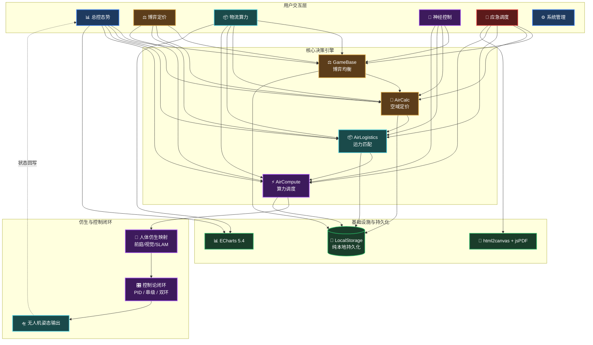

# 🧠 Y.Mine · AirMind V2.1
### 低空全域人机神经协同调度引擎 · Game-OS

<!-- ========== 🎨 彩色徽章带 ========== -->


<!-- ========== 正文开始 ========== -->

---

## 😫 传统低空调度之痛

| 痛点 | 传统方式 | AirMind 的解法 |
| :--- | :--- | :--- |
| **空域定价** | 靠拍脑袋或固定费率，旺季亏钱、淡季闲置 | 凯利公式动态博弈，自动计算最优出价比例 |
| **飞行控制** | 突遇侧风时飞控响应生硬，乘客像坐过山车 | 仿生映射将人体平衡机制迁移至无人机，稳如磐石 |
| **应急响应** | 翻 Excel 查机型匹配，黄金 10 分钟白白浪费 | 输入灾情参数，策略引擎毫秒级输出救援方案 |
| **数据安全** | 敏感运营数据上传云端，存在泄露和合规风险 | 纯本地存储，零上传，数据主权完全归用户 |

---

## 🚀 AirMind 的解法

**把“空域”变成可量化、可交易的数字资产——纯本地、零上传、秒级响应。**

AirMind 是一套**会博弈、懂仿生、能应急**的低空经济决策操作系统。它融合了凯利公式的博弈均衡、人体前庭平衡的仿生控制、以及串级 PID 的工业级闭环，让城市物流、应急救援和载人交通（UAM）的调度像呼吸一样自然。

> **一句话卖点**：让每一寸空域都产生价值，让每一次飞行都安全可控。

---

## 🧠 关于 AirMind

> **我们相信**：低空经济调度不该是僵硬的代码堆砌，而应兼具**生物的适应直觉**与**博弈论的决策理性**。

AirMind 是一套**把空域资源转化为数字资产**的决策操作系统。它不依赖云端，在浏览器本地即可完成从**博弈定价**到**仿生控制**的全链路调度。

### 📦 核心能力矩阵

| 🎯 博弈决策<br><sub>让每一笔交易都盈利</sub> | 🧬 仿生控制<br><sub>让每一次飞行都平稳</sub> | 🔒 数据主权<br><sub>让每一条数据都安全</sub> |
| :---: | :---: | :---: |
| **凯利公式驱动**<br>动态计算最优出价与资源配比，避免情绪化决策 | **人体前庭映射**<br>将皮肤风感/视觉修正迁移至飞控，姿态稳如磐石 | **纯本地运算**<br>数据永不离开浏览器，满足企业数据合规要求 |
| **空域动态定价**<br>气象/时段/拥堵三重溢价模型，让价格随行就市 | **串级双环 PID**<br>外环锁定航线(10Hz)，内环抑制姿态(200Hz) | **零信任架构**<br>无埋点、无追踪、支持一键冷备份导出 |

---

## 🖼️ 产品预览（截图占位）

> [!TIP]
> 以下为 UI 示意，实际界面以部署版本为准。

| 总控态势看板 | 博弈定价面板 | 应急调度报告 |
| :---: | :---: | :---: |
|  |  |  |
| *全局稳态色带 + 三圈演化雷达图* | *凯利公式实时推导 + 动态溢价配置* | *策略匹配结果 + PDF 报告导出* |

---

## 🔒 数据主权 · 绝对零信任

| 维度 | AirMind 承诺 |
| :--- | :--- |
| **数据流向** | 所有计算在浏览器内存与 localStorage 中完成，**永不跨过网线** |
| **第三方依赖** | 除 CDN 加载 ECharts/jsPDF 外，无任何埋点或追踪脚本 |
| **企业合规** | 满足数据本地化存储要求，无需申报数据出境 |
| **备份策略** | 支持一键导出 JSON 冷备份，完全脱离厂商锁定 |

---

## 🏗️ 分层配色架构图（Mermaid）

> 颜色层级说明：🟠 博弈/价值 · 🔵 交互/UI · 🟣 算力/AI · 🟢 存储/基建 · 🔴 应急/告警



---

## 👥 谁在用？（用户画像）

| 角色 | 日常场景 |
| :--- | :--- |
| **调度指挥官** | 监控全域态势，调整空域定价，确保运力与需求实时平衡 |
| **应急响应员** | 快速录入突发事件，获取 AI 策略推荐，导出标准化处置报告 |
| **系统管理员** | 管理空域网格、企业白名单、机型库及电池健康台账 |
| **监管机构** | 查看空域资源利用率和定价透明度，辅助宏观决策 |

---

## 📖 用户故事：一次惊心动魄的暴雨调度

> 比功能列表更直观——看看 AirMind 如何在真实危机中力挽狂澜。

**🌧️ 场景：暴雨突至，空域负载率飙升**

- **14:00 危机浮现**：KPI 看板上均衡度指数飙红（**0.72**），熔断阈值逼近。暴雨导致 30 架次航班延误，起降点拥堵系数已达 85%。
- **14:02 动态调价**：调度员在 **Tab 2（博弈定价）** 将气象溢价滑条从“多云”拨至“雷暴”，拥堵费起征阈值从 70% 下调至 60%。凯利公式（`f* = (b·p - q)/b`）**实时反馈**：建议将高频短途订单的出价频率降低 35%，避免亏本接单。
- **14:05 运力重组**：**Tab 3（物流算力）** 自动触发错峰调度，将低电量（SOH < 70%）的无人机标记为“仅限短途”，同时推荐 3 架高续航机型执行长途加急药品订单，匹配度分别为 97%、94%、89%。
- **14:08 姿态避险**：一架执行中的无人机突遇 15m/s 侧风。**Tab 4（神经控制）** 的仿生映射瞬间生效——从“落地窗（人工高干预）”平滑切换至“平开窗（多电机冗余）”模式。外环（10Hz 航线锁定）与内环（200Hz 姿态抑制）双环串级控制协同，**全程无颠簸，稳如泰山**。
- **14:15 恢复稳态**：10 分钟后均衡度回落至 **0.52**（绿色安全区），系统自动解除熔断预警。高溢价紧急订单全部进入执行队列，单小时营收逆势增长 12%。

---

## 🧩 核心功能速览（Tab 概览 + 一句话卖点）

| Tab | 名称 | 🔥 一句话卖点（用户视角） |
| :---: | :--- | :--- |
| 1 | 📊 总控态势 | “扫一眼色带颜色，就知道今天能不能赚钱” |
| 2 | ⚖️ 博弈定价 | “数学公式帮你决策，避免情绪化竞标” |
| 3 | 📦 物流算力 | “比老调度员更懂每一块电池的剩余价值” |
| 4 | 🧬 神经控制 | “侧风吹来？飞机自己会像老司机一样修正” |
| 5 | 🚨 应急调度 | “灾情录入后，方案比 119 先到” |
| 6 | ⚙️ 系统管理 | “管飞机像管车队，一块电池都不放过” |

---

## ⚡️ 5 分钟快速上手（零安装）

> [!IMPORTANT]
> **首次使用必读**：本系统所有数据仅保存在**当前浏览器**中。清除浏览器缓存（Cookie 和站点数据）将导致所有配置丢失，请务必在 Tab 5 中**定期导出 JSON 备份**。

> [!TIP]
> 如果想重置所有模拟数据，在浏览器控制台输入 `localStorage.clear()` 即可恢复出厂状态。

**本地运行（无需 Node.js）：**
```bash
git clone https://github.com/Y-Mine/airmind-os.git
cd airmind-os
# 双击 index.html 直接运行，或用 VS Code Live Server 打开
```

**5 步走完完整闭环：**
1. **配置**（Tab 6）→ 注册 2 家企业，录入 4 款无人机机型。
2. **创建任务**（Tab 3）→ 输入载重/距离，系统自动推荐 Top 3 匹配机型（含电池 SOH 校验）。
3. **博弈竞价**（Tab 2）→ 滑动参数，凯利公式实时计算最优出价比例。
4. **总控监视**（Tab 1）→ 观察“绿/黄/红”稳态色带，追踪四大底座（博弈→定价→物流→算力）的流光动画。
5. **应急演练**（Tab 5）→ 填入“火势等级/被困人数”，看策略引擎秒级亮出最优解并导出 PDF。

---

## ⚡ 性能压测（Chrome 环境）

> 纯前端也能干重活——以下数据基于 Intel i7 / 16GB 实测。

| 测试场景 | 性能指标 |
| :--- | :--- |
| **万级任务工单渲染** | ≤ 200ms（虚拟滚动优化） |
| **凯利公式实时重算** | ≤ 16ms（每帧刷新，无卡顿） |
| **PDF 报告生成**（含 3 张 ECharts 图表） | ≤ 1.5s |
| **电池健康台账批量更新**（1000 条记录） | < 50ms |
| **策略引擎匹配**（6 条规则并行） | < 10ms |

---

## 🗺️ 路线图（Roadmap V2.2 → V3.0）

展示项目活力，欢迎贡献者加入！

| 版本 | 规划功能 | 状态 |
| :--- | :--- | :---: |
| V2.2 | **多机协同编队**：支持 1 控多机的仿生蜂群映射算法 | 🚧 开发中 |
| V2.3 | **数字孪生地图**：集成 Mapbox GL，可视化禁飞区与实时航线 | 📋 规划中 |
| V2.4 | **历史数据回放**：支持按时间轴回放空域态势变化 | 📋 规划中 |
| V3.0 | **AI 语音调度**：接入本地 Whisper 模型，语音指令下达 | 🔮 远期 |
| V3.0 | **私有化部署包**：Docker 镜像 + Nginx 反向代理 | 🔮 远期 |

---

## 🛠️ 技术栈与网络要求

| 层级 | 技术 | 版本 | 用途 |
| :--- | :--- | :--- | :--- |
| 核心 | Vanilla JS (ES6+) | — | 零依赖，逻辑与视图解耦 |
| 样式 | CSS3 + CSS Variables | — | 黑暗主题 + 磨砂玻璃质感 |
| 可视化 | ECharts | 5.4.3 | 雷达图/仪表盘/热力图/模拟地图 |
| 导出 | html2canvas + jsPDF | 1.4.1 + 2.5.1 | 截图渲染生成 PDF 报告 |
| 存储 | window.localStorage | — | 纯本地持久化，无需后端 |
| 字体 | Inter / JetBrains Mono | — | UI 阅读与数字展示优化 |

> **网络要求**：仅首次加载需联网（加载 ECharts/jsPDF 等 CDN 库），加载成功后支持完全离线运行（需 Service Worker 配合）。

---

## 📂 目录结构（可折叠）

<details>
<summary><b>📁 点击展开</b></summary>

```
airmind-os/
├── index.html                 # 主入口 SPA
├── assets/
│   ├── css/                   # tokens / components / layouts
│   ├── js/
│   │   ├── core/              # store / engine / simulator / utils
│   │   └── modules/           # 6 个 Tab 独立模块 + main.js
│   └── fonts/                 # Inter & JetBrains Mono
└── docs/                      # API / 算法白皮书 / 部署 / 更新日志
```
</details>

---

## 🤝 贡献指南

本项目采用 **Design-First（设计先行）** 开发模式。Figma 设计稿 → 组件化开发 → 数据驱动解耦。

```bash
git checkout -b feature/your-idea
git commit -m "feat: 简洁描述你的改动"
git push origin feature/your-idea
# 提交 Pull Request
```

> **代码规范**：HTML 语义化 + BEM 命名；CSS 使用 Variables；JS 采用 ES6+ 函数式优先。

---

## 📄 许可证 & 公私分离架构

| 层级 | 内容 | 许可证 |
| :--- | :--- | :---: |
| **公开层**（本仓库） | UI/交互/通用算法 |  |
| **私有内核**（密封存证） | 双层阻尼张量、内外对流矩阵、地层应力模型 | 🔒 不公开 |

---

## 📬 联系与反馈

- **问题反馈**：[GitHub Issues](https://github.com/Y-Mine/airmind-os/issues)
- **邮箱**：hellomind-y@outlook.com

---

**V2.1 · Game-OS · GameMind Subsystem**  
*“让每一寸空域都产生价值，让每一次飞行都安全可控。”*
```

---

如果还需要微调某个区块的颜色倾向或增加/删除某些徽章，随时告诉我！😊
